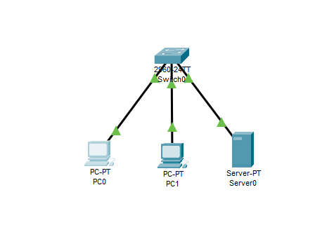

# Exercício 6
## Sobre o projeto:
Esse projeto tem como objetivo simular um ambiente onde um servidor DNS foi utilizado. 
## Exercício utilizado para a criação do projeto:
+ 1 Switch 2960
+ 1 Server PT
+ 2 PCs
+ Todos os computadores estão na rede 192.168.0.0/24
+ Configure o servidor DHCP
+ Configure o servidor DNS para acessa o endereço ip do servidor
## Tecnologias utilizadas:
O projeto utiliza o Cisco Packet Tracer. 

## Principais funcionalidades:
Simular um ambiente onde um servidor DNS for configurado. \
!

